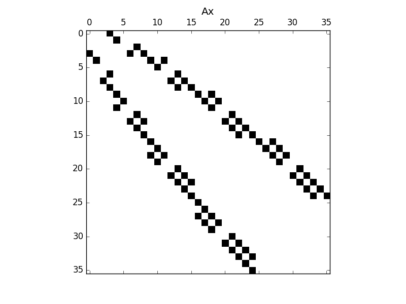
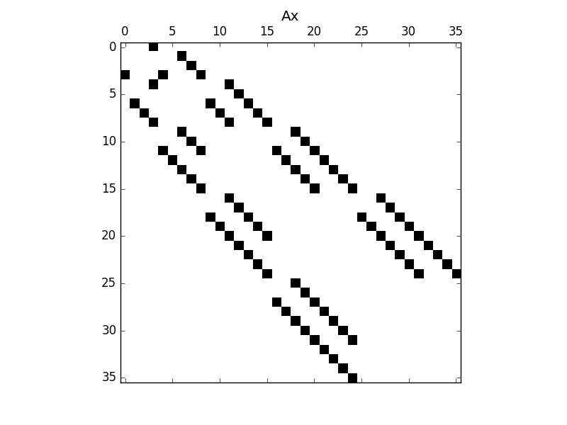
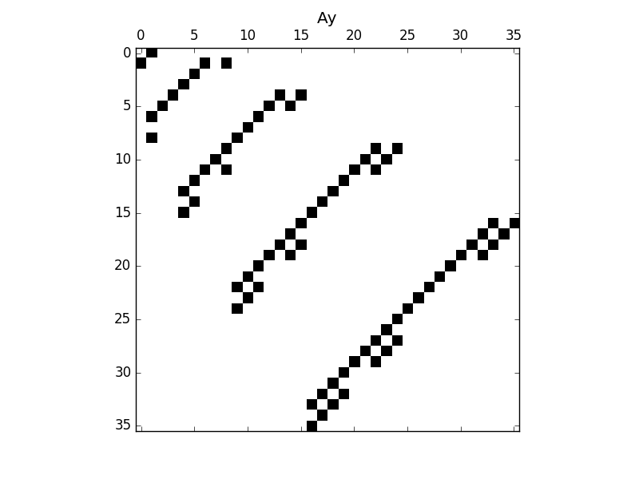
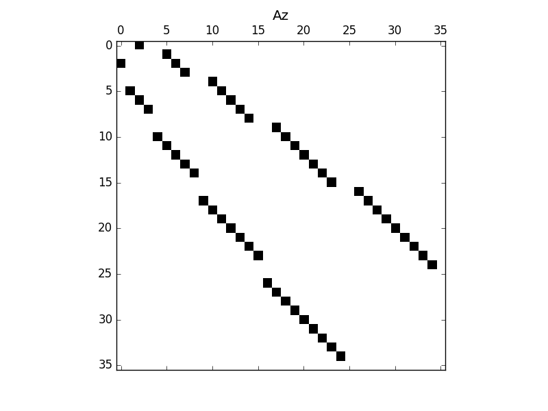
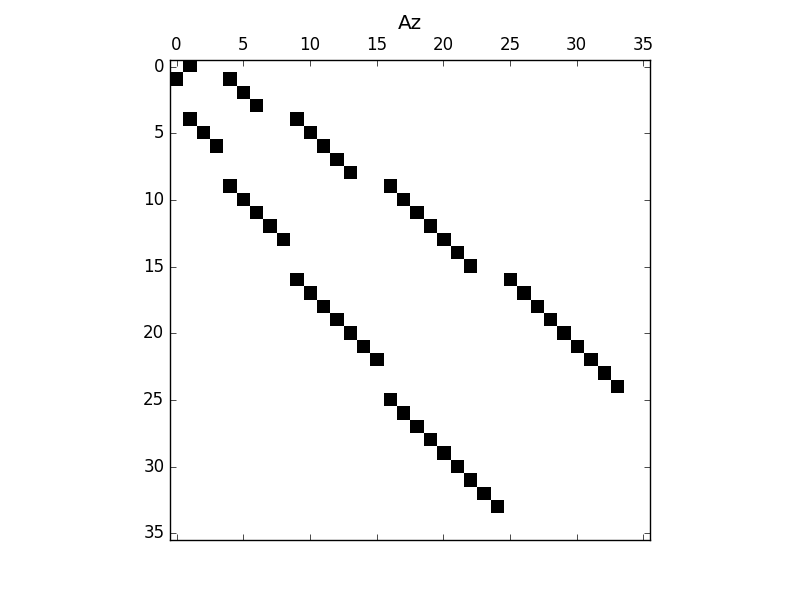
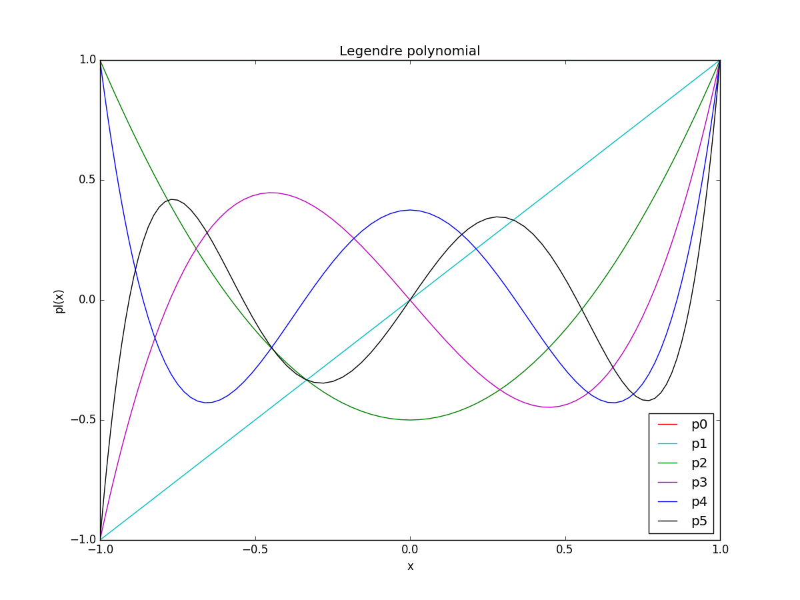
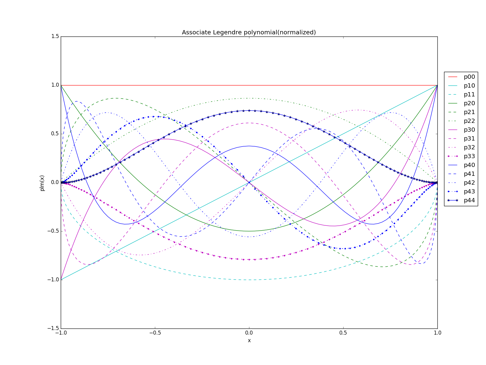
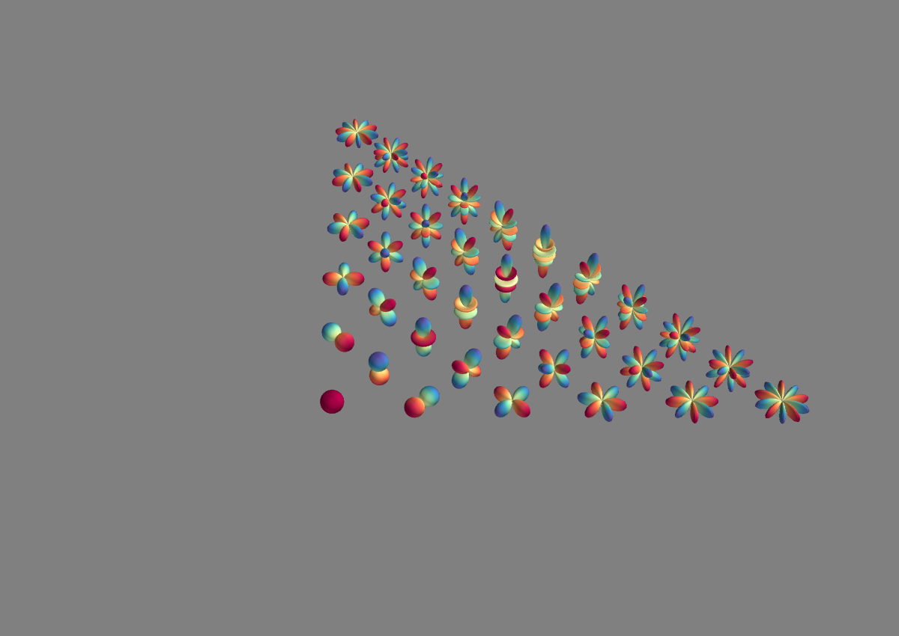

*sh_module* 是球谐函数相关的模块，包含
+ [sh_module](./src/lib/sh_module.90)球谐函数模块，包含以下
  - [sh_dof](./src/lib/sh_dof.90) 球谐函数自由度管理

    实际计算中，用球谐函数来进行展开时并不用使用所有 *l<N* 的球谐函数，而是根据被展开函数的对称性从球谐函数中选取了某些球谐函数来作为基函数，在 *SH_DOF* 中定义了shdof 类
    ``` Fortran
    type :: shdof
       !!> index type
       integer :: type  = 1
       !!> max order of spherical harmonic
       integer :: pnmax = 0
       !!> number of dimension
       integer :: dim   = 0
       !!> number of freedom 1d:pn+1, 2d:(pn+1)(pn+2)*0.5, 3d:(pn+1)*(pn+1),
       integer :: nm    = 0
       !!> max degree of freedom md = (pn+1)*(pn+1)
       integer :: md    = 0
       !!> the nmj table (md,3)
       integer, allocatable :: nmj(:,:)
       !!> dof (nm)
       integer, allocatable :: dof(:)
     contains
       procedure :: clear
       procedure :: print
       procedure :: index_j
       procedure :: index_n
       procedure :: index_nm

    end type shdof

    ```
    其中 *shdof%nmj* 就是球谐函数二维下标 *n*,*m* 转化为一维下标的 *j* 的对应关系。这里定义了两种对应关系，在函数 *shdof%index_j* 中定义。*shdof%dof* 是选取的球谐函数的一维下标。对于三维情况，所有 *l<N* 都被选取，对于二维XY平面，由于对称性，只选取了 *mod(m+n,2)==0* 的球谐函数，对于一维情况，只选取 *m=0* 的球谐函数，即勒让得多项式。

  - [SH_Recurrence](./src/lib/SH_Recurrence.F90) 球谐函数递推公式
    通过球谐函数递推关系得到 *omigaYlm* 与Ylm的关系,调用函数为 *recur = SH_recur(n,m)*  返回一个recur对象，包含递推关系后的球谐函数下标 *recur%index* 和系数 *recur%coef*。 此外，该模块中还定义了球谐函数的积分 *val = SH_Integral(omiga1,n1,m1,omiga2,n2,m2)* ,该函数返回两个球谐函数与 *omiga1*,*omiga2* 乘积在整个球面上的积分。通过该函数可以求得 *Ax*,*Ay*,*Az*。在 [testSH_Recur](./src/test/testSH_Recur.F90)中求出了 *Ax*,*Ay*,*Az*，通过python可以画出这些矩阵的稀疏矩阵图如下(自由度按不同的排序方式得到不同的稀疏矩阵)

    - Ax
      
      
    - Ay
      
      
    - Az
      
      

  - [sh_value](./src/lib/sh_value.f90) 球谐函数定义
    利用 pyhton来验证 [sh_value](./src/lib/sh_value.F90)中球谐函数 *Ylm* 以及连带勒让得多项式的正确性。
    通过以下命令生成动态库 *sh.so*,然后直接在pyhton中使用。
    >f2py -c sh_value.f90 -m sh

    通过 [plot_pl](./tools/plot_pl.py),[plot_plm](./tools/plot_plm.py),[plot_ylm](./tools/ploplot_ylm.py)画出勒让得多项式，连带勒让得多项式和球谐函数的图像来验证定义的球谐函数的正确性。图像如下

    - LegendrePolynomial
      
    - AssociateLegendrePolynomial
      
    - SphericalHarmonics
      
